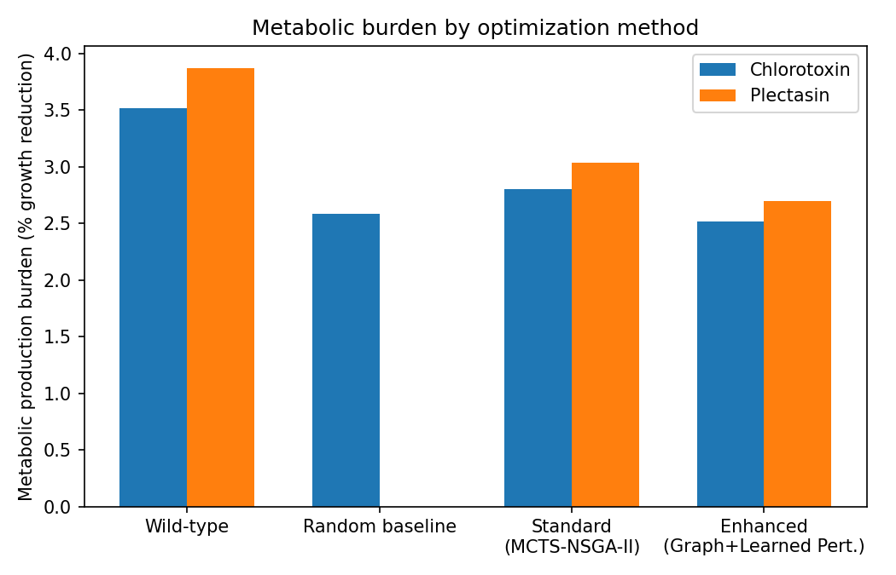
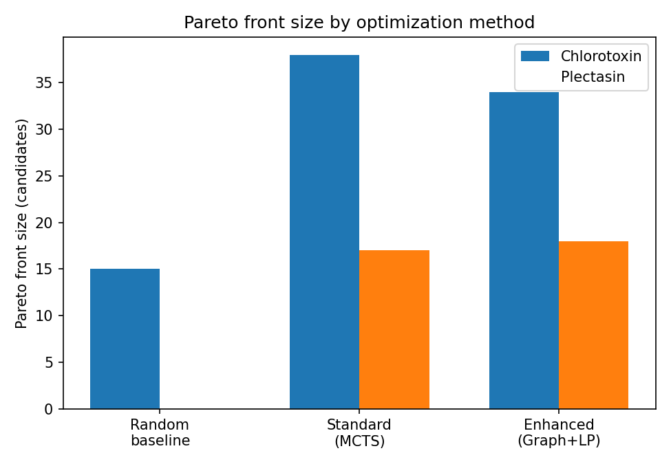
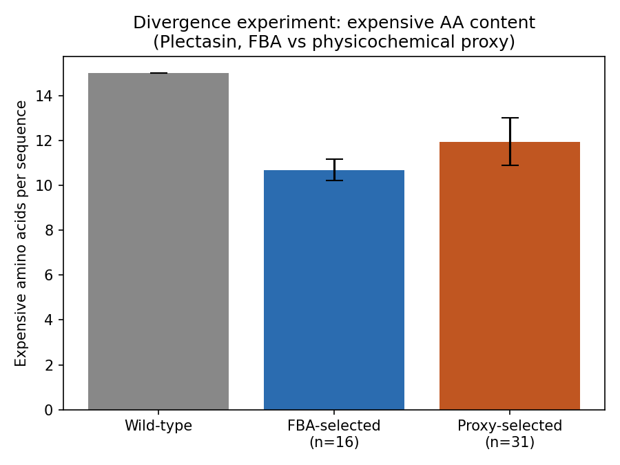
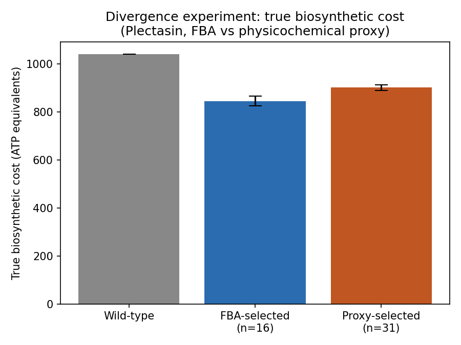
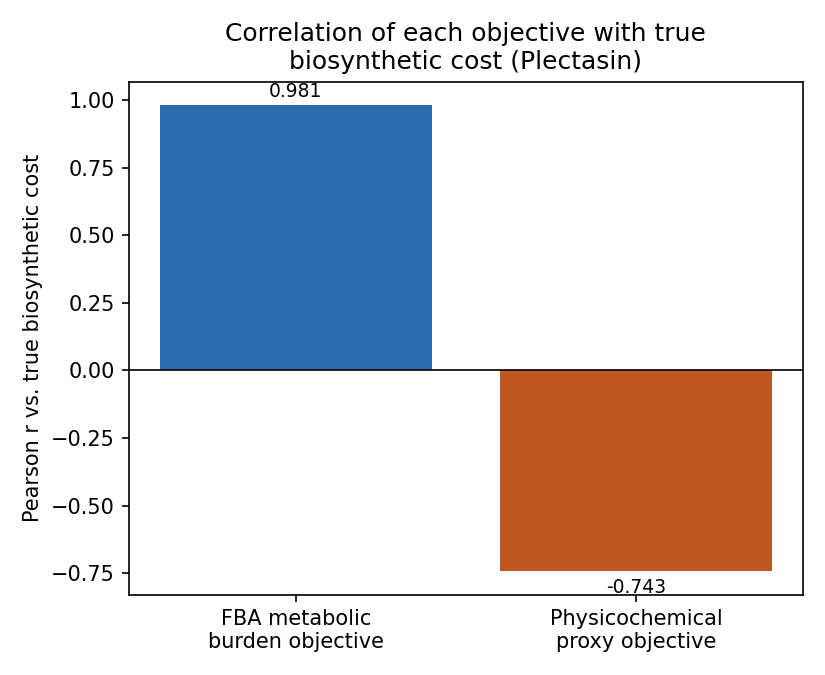
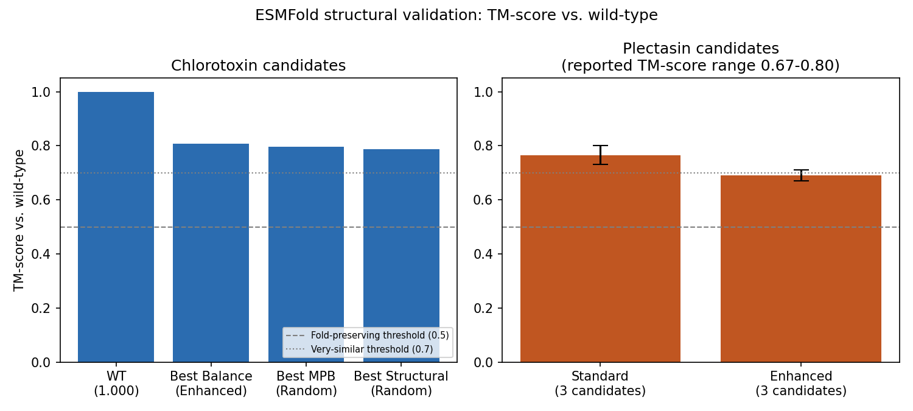

# BioForge

Multi-objective peptide design coupling genome-scale metabolic modelling (FBA) to evolutionary sequence optimisation, validated on chlorotoxin and Plectasin.


---

## What this is

Most computational antimicrobial peptide (AMP) design pipelines score
manufacturability with physicochemical proxies (instability index,
GRAVY/hydrophobicity, aliphatic index). Those proxies were built to predict
protein stability, not biosynthetic cost, and they don't model the
stoichiometric constraints of an actual production organism.

BioForge replaces the proxy with **flux balance analysis (FBA) on a
genome-scale metabolic model** (iML1515, *E. coli* K-12: 1,516 genes, 2,712
reactions, 1,877 metabolites) as a co-equal Pareto objective alongside a
ProteinMPNN-derived structural fitness score. A multi-objective evolutionary
loop (NSGA-II, with either an MCTS mutation operator or a learned-graph
perturbation operator) then searches sequence space for variants that are
simultaneously fold-preserving and cheaper to biosynthesize than wild-type.

A controlled divergence experiment on Plectasin shows the FBA and proxy
objectives select almost entirely different regions of sequence space
(Jaccard similarity = 0.022 between their Pareto fronts), and that FBA finds
sequences with a significantly larger true biosynthetic cost reduction
(Cohen's d = -3.75) than the proxy does.

---

## Repository structure

```
bioforge_clean/
├── setup/
│   └── setup.sh                    # installs deps, clones ProteinMPNN, downloads iML1515
├── phase1/                         # structure ingestion + metabolic pathway mining
│   ├── structure_parser.py
│   ├── metabolic_miner.py
│   ├── graph_compiler.py
│   └── run_phase1.py
├── phase2/                         # design mask + ProteinMPNN feasibility map
│   ├── mask_builder.py
│   ├── protein_mpnn_runner.py
│   ├── feasibility_map.py
│   └── run_phase2.py
├── phase3/                         # FBA infrastructure + metabolic smoke test
│   ├── fba_model_loader.py
│   ├── peptide_demand_builder.py
│   ├── fba_evaluator.py
│   └── run_phase3.py
├── phase4/                         # primary NSGA-II + MCTS optimization
│   ├── sequence_utils.py
│   ├── mcts_operator.py
│   ├── nsga2_engine.py
│   ├── pareto_archive.py
│   ├── run_phase4.py
│   ├── existence_analysis.py       # 5-line-of-evidence existence proof
│   └── benchmark_random_baseline.py
├── phase4e/                        # enhanced Graph-NSGA-II + learned perturbation
│   ├── fitness_graph.py
│   ├── learned_perturbation.py
│   ├── graph_nsga2_engine.py
│   └── run_phase4_enhanced.py
├── phase5/                         # FBA vs. physicochemical-proxy divergence experiment
│   ├── proxy_evaluator.py
│   ├── run_phase5_proxy.py
│   └── divergence_analyzer.py
├── validators/                     # Pareto plots, sequence analysis, ESMFold validation
│   ├── validate_pareto_visualizer.py
│   ├── validate_sequence_analyzer.py
│   └── validate_esm_fold.py
├── figures/                        # charts generated from the paper's data (see below)
├── important_stuff_you_need_to_know.txt   # how to configure the pipeline for a new peptide
├── requirements.txt
├── .gitignore
└── LICENSE
```

Every hardcoded, peptide-specific value (PDB code, chain ID, expected
sequence, frozen-position mask layers) is wrapped in the source with:

```python
# >>> PEPTIDE_SPECIFIC: replace for a new target peptide
...
# <<< END_PEPTIDE_SPECIFIC
```

See `important_stuff_you_need_to_know.txt` for the full walkthrough of what
to change and where, to point this pipeline at a new target peptide.

---

## Pipeline

| Phase | Purpose |
|---|---|
| **1** | Downloads the target structure from RCSB, extracts backbone coordinate tensors, and mines per-residue biosynthetic pathway data (KEGG, with local fallback) into a manufacturing dependency graph. |
| **2** | Builds the frozen/mutable design mask from biological rationale (disulfides, binding face, geometry anchors), then runs ProteinMPNN in unconditional-probability mode to get a per-position amino acid feasibility map. |
| **3** | Loads the iML1515 genome-scale model, builds a synthetic demand reaction for heterologous expression of the target peptide, and runs a smoke test confirming FBA burden scores respond correctly to composition changes. |
| **4** | NSGA-II with a two-phase MCTS mutation operator, optimizing structural fitness (ProteinMPNN log-probability ratio vs. wild-type) against FBA metabolic production burden (MPB). Includes a random-mutation baseline and a five-line-of-evidence existence analysis (direct Pareto inspection, Monte Carlo basin sampling, an intermediate-value-theorem path argument, a Gaussian process surrogate, and natural-homolog rediscovery). |
| **4E** | An enhanced variant of Phase 4: a fitness graph over all evaluated sequences plus a learned perturbation model that samples mutations from a posterior over historically successful substitutions, with a stagnation-triggered escape mechanism. |
| **5** | Reruns Phase 4 with the FBA objective swapped for a physicochemical proxy (0.5 × instability index + 0.5 × normalized GRAVY), then quantifies how much the two objectives diverge in the sequences they select. |
| **Validators** | Pareto front visualization, mutation/physicochemical/mask-compliance analysis across the front, and ESMFold-based structural validation (TM-score vs. wild-type) of the final candidates. |

### Structural fitness objective

For candidate sequence `s`, scored only over mutable positions against the
ProteinMPNN prior conditioned on the fixed backbone:

```
S(s) = sum_i [ log P(s_i | backbone) - log P(wt_i | backbone) ]
```

### Metabolic cost objective

Metabolic production burden (MPB) is the fractional reduction in *E. coli*
biomass growth rate when the model is constrained to co-express the
candidate sequence as a heterologous product, computed via FBA on iML1515.
Lower MPB = lower biosynthetic burden = more manufacturable.

---

## Results at a glance

**Metabolic burden by optimization method**, both validated peptides
(wild-type vs. random-mutation baseline vs. MCTS-NSGA-II vs. the enhanced
Graph+learned-perturbation variant):



**Pareto front size** — the enhanced method and MCTS both substantially
outproduce the random baseline in front size, with the enhanced method
edging out MCTS on best absolute MPB:



**Divergence experiment** (Plectasin): FBA-selected and proxy-selected
Pareto fronts diverge almost completely (Jaccard = 0.022). FBA sequences
contain fewer expensive amino acids on average, and a substantially lower
true biosynthetic cost, than proxy sequences — despite both starting from
the same wild-type baseline:




**Why they diverge**: FBA-derived burden correlates strongly with true
per-sequence biosynthetic cost (Pearson r = 0.981); the physicochemical
proxy is *negatively* correlated with it (r = -0.743) — meaning the proxy
is, on a meaningful fraction of candidates, pointing in the wrong direction
entirely, not just less sensitive than FBA:



**ESMFold structural validation** — all evaluated candidates for both
peptides preserve the native fold (TM-score >= 0.5 vs. wild-type; several
candidates score >= 0.7, "very similar to wild-type"):



---

## Setup

```bash
bash setup/setup.sh
pip install -r requirements.txt
```

`setup.sh` installs Python dependencies, clones ProteinMPNN into
`./bio_pipeline/ProteinMPNN`, and downloads the iML1515 model into
`./bio_pipeline/models/iML1515.xml`.

Then configure the pipeline for your target peptide — see
`important_stuff_you_need_to_know.txt` — and run phases 1 through 5 (or
4/4E only, if you don't need the proxy-divergence comparison) in order,
each reading the previous phase's output from `./pipeline_artifacts/`.

---

## Known limitations

- FBA models biosynthetic cost specifically within *E. coli* K-12
  metabolism (iML1515); a different expression host would need its own
  genome-scale reconstruction and may rank candidates differently.
- The structural objective is a ProteinMPNN log-probability proxy, not an
  energy function or an activity predictor — ESMFold validation supports
  fold preservation, but binding affinity and antimicrobial activity are
  not modeled and require experimental follow-up.
- No candidate from either validated run has been synthesized or
  experimentally tested; this is a computational design framework, and the
  path to wet-lab validation (solid-phase peptide synthesis, MIC assay)
  remains open.

---

## License

MIT — see [LICENSE](LICENSE). Copyright (c) 2026 Satya Thavanesh Yalla.
